# CriptaBit

Criptabit is an Android app that tracks and displays prices, charts, markets, and fundamentals of over 1500 crypto currencies! an 10K+ Stoks symbols The app is completely open source with NO ADS EVER! It was a labor of love. I have spent months working on it every night after I get home from work and on weekends. 

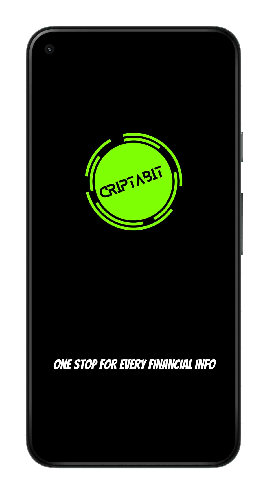
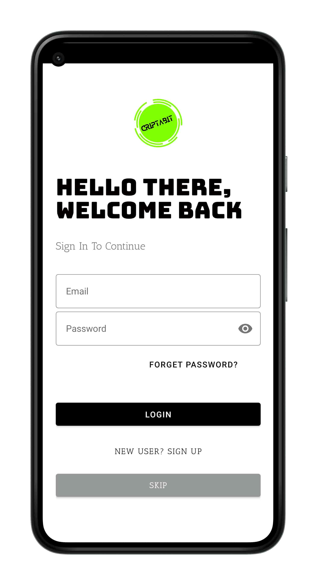
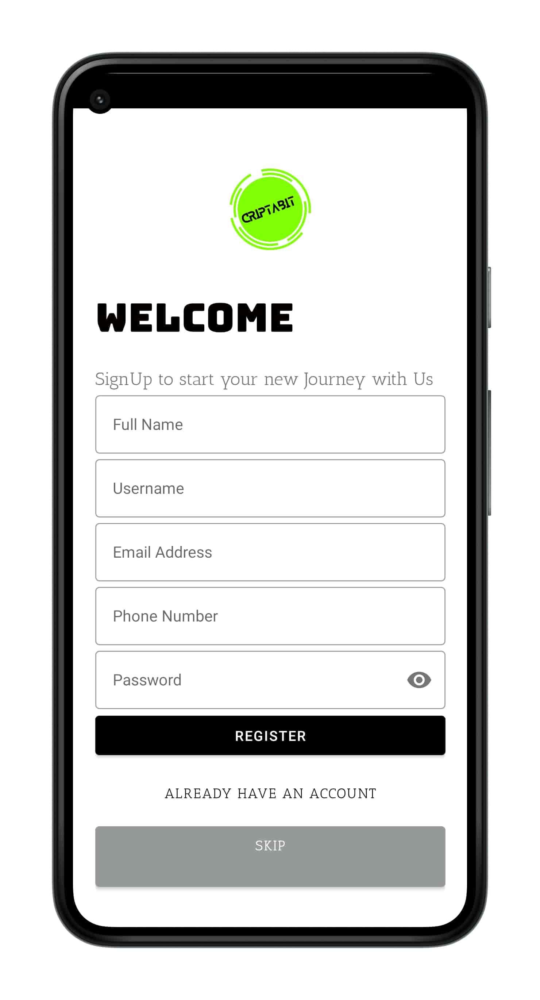
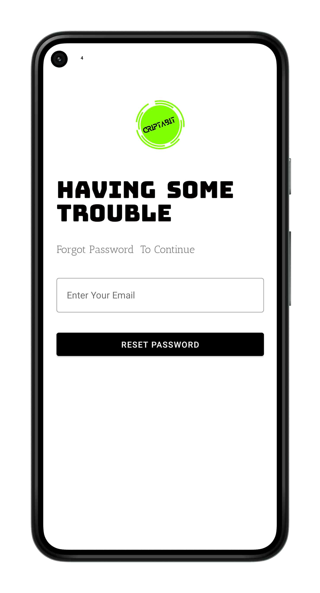
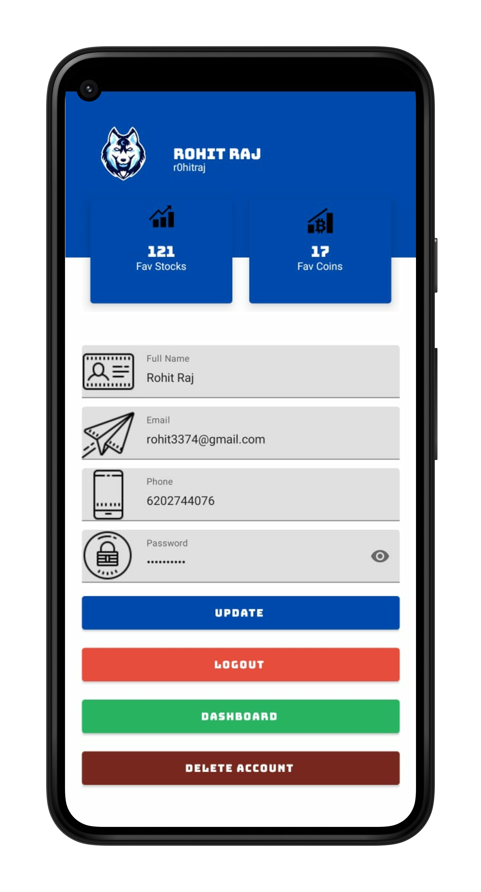
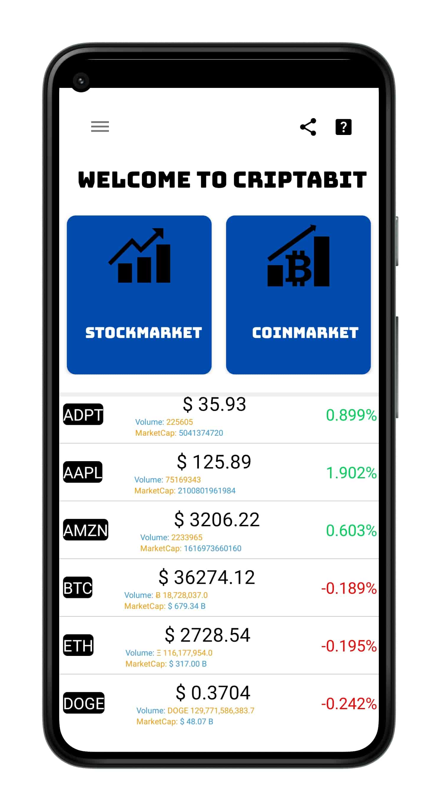
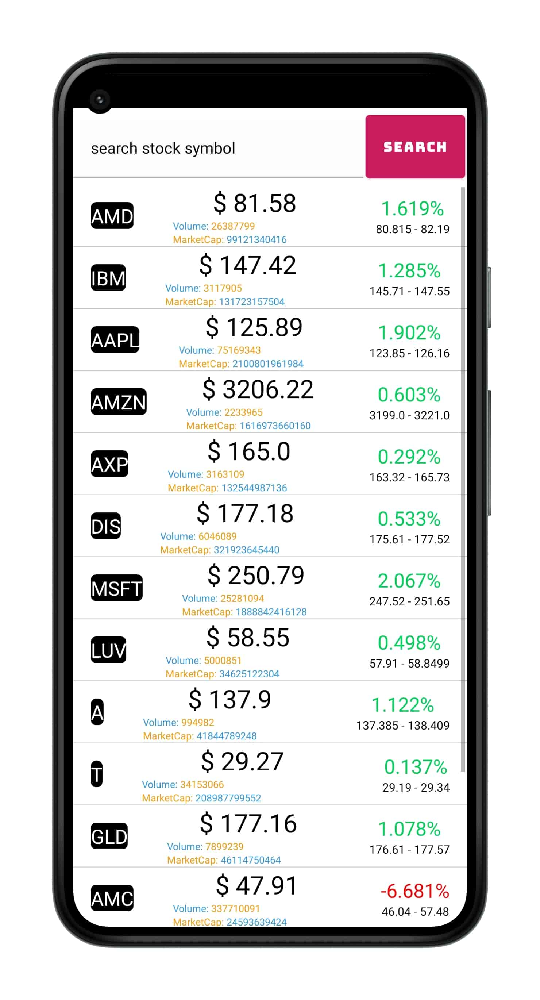
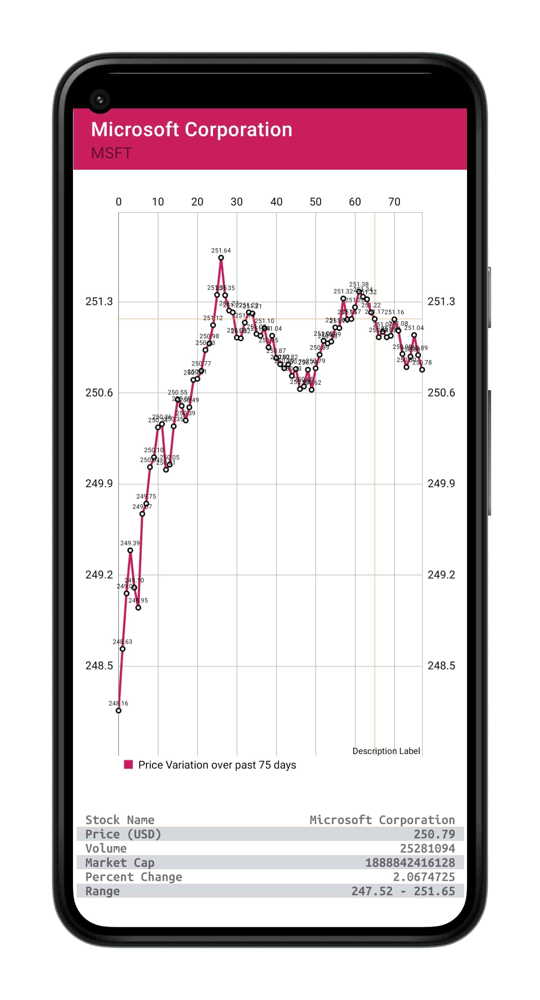
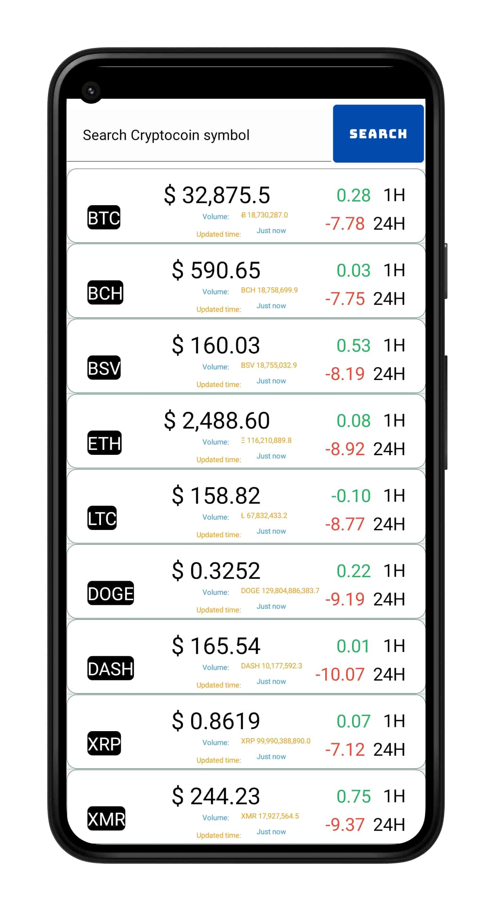
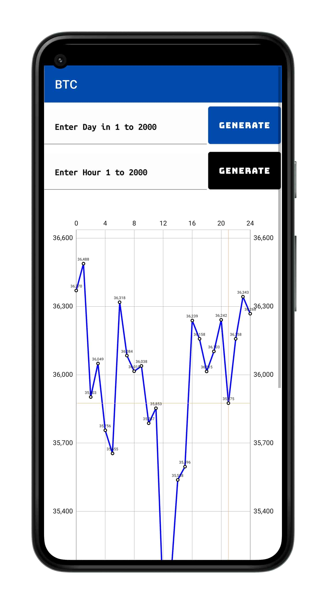
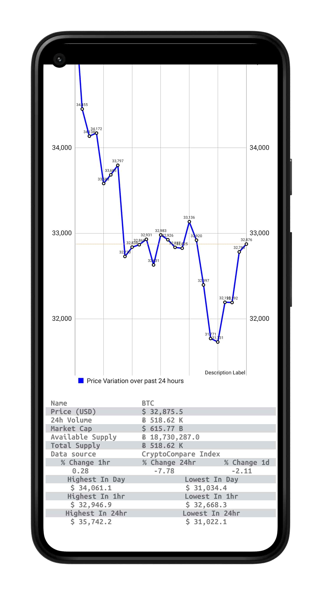
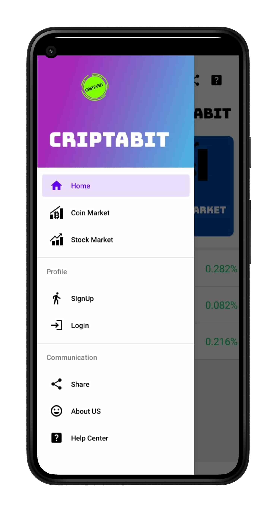
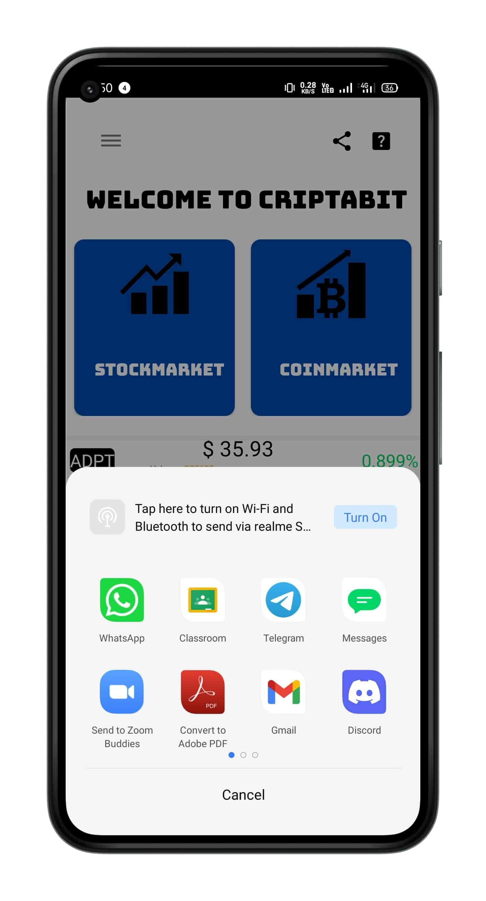

## Features

* Displays market cap, volume, percent change, price, and coin image for over 1500 crypto currencies and 10K+ Stocks Symbols
  - List is sortable and searchable
* Users can add favorites to a separate tab so that they can keep a close eye on the currencies they care about
* Displays charts for price over time of each currency and Stock Symbols at different intervals
  - Users can drag their fingers across the chart to see the price at a given time
  - Chart displays data in USD 
* Statistics about the supply of each currency and Stock Symbol are displayed on a table under the chart and 
* Easily navigate directly to the CoinMarket page for a currency from right inside the app to the StockMarket Page throught Side Drawer
* Displays markets for each currency  and Stock symbol sorted by volume

## Libraries Used

* <a href="https://github.com/fcopardo/EasyRest">EasyRest</a>: This library is used extensively for all network calls within the app. It takes care of request caching, multi-threading, and marshalling JSON into objects with Jackson
* <a href="https://github.com/afollestad/material-dialogs">material-dialogs</a>: Library used to show the sorting dialog 
* <a href="https://github.com/nex3z/ToggleButtonGroup">ToggleButtonGroup</a>: Library used for the buttons which allow users to toggle the date range on the chart
* <a href="https://github.com/IvBaranov/MaterialFavoriteButton">MaterialFavoriteButton</a>: Library used for the favorite button on the home screen
* <a href="https://github.com/PhilJay/MPAndroidChart">MPAndroidChart</a>: Used to show price over time chart
* <a href="http://square.github.io/picasso/">Picasso</a>: Library used for hassle-free image loading and display
* <a href="https://github.com/google/gson">GSON</a>: Library used to serialize text from the database into real Java objects and vice-versa

* <a href="https://firebase.google.com/">Firebase</a>: Firebase for providing real time authentication

## Permissions

`android.permission.ACCESS_NETWORK_STATE`  
`android.permission.INTERNET`

These two permissions are required so that we can talk to the APIs on the internet that give us information about crypto currencies

## Sources

* <a href="https://min-api.cryptocompare.com/">CryptoCompare</a>: Huge thanks to CryptoCompare! Without their APIs this app would not be possible. They are the backend for chart data, coin images, market caps, volume, prices, and percent changes
* <a href="https://rapidapi.com/apidojo/api/yahoo-finance1/">Yahoo Finance-api</a>: This API Is Used for Accesing data of stock Market (symbol and all)
* <a href="https://shields.io/">shields.io</a>: Provides the beautiful build badges at the top of this README
* <a href="https://www.flaticon.com/authors/smashicons" title="Smashicons">Smashicons</a>For Wonderfull icons
